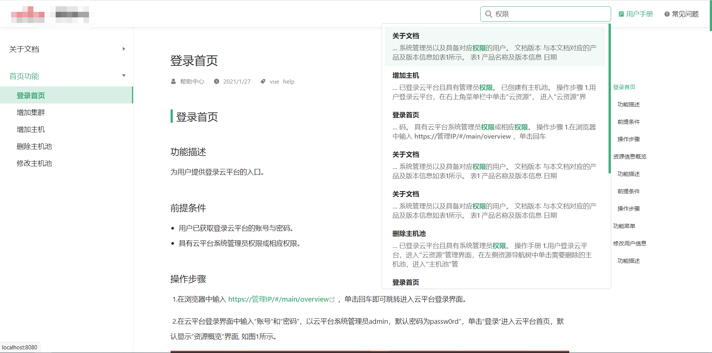

# vuepress-plugin-flexsearch-pro

本项目在[vuepress-plugin-flexsearch](https://github.com/z3by/vuepress-plugin-flexsearch.git)的基础上进行修改。

Next-Generation full text search library for Vuepress

> A great replacement of the default Vuepress search plugin.

## Installation

```bash
yarn add -D vuepress-plugin-flexsearch-pro
// or npm install vuepress-plugin-flexsearch-pro -D
```

## Usage

Use the default settings:

```js
// .vuepress/config.js

module.exports = {
    plugins: [
      ['flexsearch'],
      // other plugins
    ]
}
```

Or modify the settings to match your needs:

```js
// .vuepress/config.js

module.exports = {
    plugins: [
      ['flexsearch', {
        /*
          Plugin custom options
        */
        searchPaths: ['path1', 'path2'],    // an array of paths to search in, keep it null to search all docs.
        searchHotkeys: ['s'],    // Hot keys to activate the search input, the default is "s" but you can add more.
        searchResultLength: 60,    // the length of the suggestion result text by characters, the default is 60 characters.
      }],
      // other plugins
    ]
}
```
## 修改说明
**config.js**

 1、不在支持search_options自定义，不能定义flexsearch的Options。
 2、去掉了maxSuggestions，一般全局搜索都展示所有的结果，不会限定搜索出来的结

**index.js**
将flexsearch的option定义放到了SearchBox.vue中

**SearchBox.vue**
1、适配中英文搜索，依据搜索的关键词（query）判断是中文还是英文进行匹配FlexSearch实例。
2、修改呈现样式，增加滚动条

## 呈现效果


## Credit

Thanks to [nextapps-de/flexsearch](https://github.com/nextapps-de/flexsearch) & [vuepress-plugin-flexsearch](https://github.com/z3by/vuepress-plugin-flexsearch.git)

## Contributions

PRs are welcome :heart:
